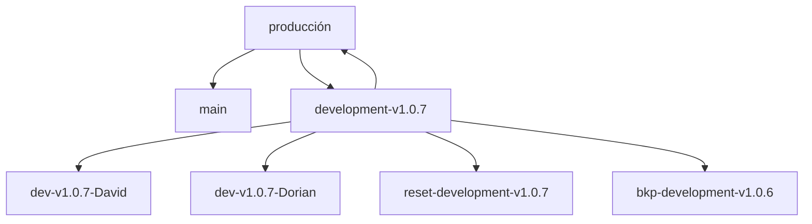
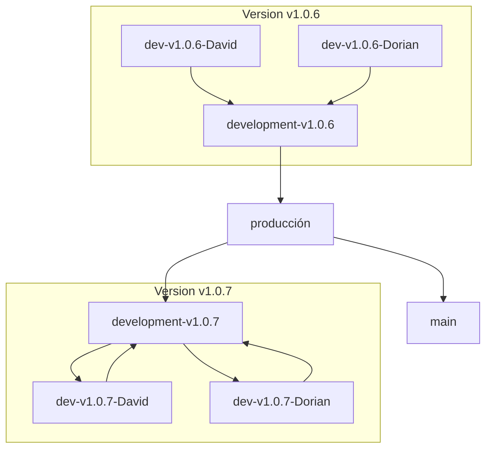

# Estrategia para el Uso de Ramas en GitHub

## Introducción

Esta estrategia define una forma estructurada de trabajar con ramas en un repositorio de GitHub. El objetivo es optimizar la colaboración entre desarrolladores, garantizar la estabilidad del código funcional y facilitar una integración controlada hacia producción, manteniendo una organización por versiones y por colaborador.

## Estructura de las Ramas

### Rama Main (`main`)
Contiene código estable y listo para producción. Solo recibe actualizaciones desde `producción` tras pasar todas las validaciones.

- Uso: lanzamientos a producción.
- Protección: evitar pushes directos; requerir PRs aprobados.

---

### Rama Producción (`producción`)
Puerta final antes de integrar el código en `main`. Las versiones aprobadas (QA, pruebas de integración, etc.) se promueven desde `development-vx.x.x` hacia `producción`. Además, sirve como base para iniciar la siguiente versión.

- Uso: validaciones finales de release y preparación de despliegue.
- Origen de nuevas ramas de desarrollo: se usa como base para crear la siguiente `development-vx.x.x`.

---

### Rama de Desarrollo por Versión (`development-vx.x.x`)
Para cada versión se crea una rama `development-vx.x.x` (ej. `development-v1.0.7`). Es el hub central de integración para esa versión.

- Se crea como copia exacta de `producción` al iniciar una nueva versión.
- Debe configurarse como la rama por defecto del repositorio para la versión vigente.
- Recibe PRs desde las ramas individuales de colaboradores.

---

### Ramas de Colaboradores (`dev-vx.x.x-Nombre`)
Cada colaborador trabaja en su rama aislada, derivada de la rama de desarrollo por versión.

- Ejemplos: `dev-v1.0.7-David`, `dev-v1.0.7-Dorian`.
- Flujo: PRs desde cada rama `dev-*` hacia la rama `development-vx.x.x` correspondiente.

---

### Ramas de Respaldo y Restauración
Para preservar estados y facilitar rollbacks:

- Respaldo: `bkp-development-v1.0.6`
- Restauración: `reset-development-v1.0.6`

---

## Diagrama: Estructura General

---

## Diagrama: Cambio de Versión

Lógica al pasar de una versión a otra:

1) Se hace PR de `development-v1.0.6` a `producción` (se entiende que pasó QA).
2) Se crea `development-v1.0.7` como copia exacta de `producción` y se define como rama por defecto.
3) Las ramas de colaboradores de la nueva versión se crean desde `development-v1.0.7`.
4) Los PRs de las ramas `dev-v1.0.6-*` van solo a `development-v1.0.6`. Al cerrarse la versión, quedan ociosas y se inicia el nuevo ciclo en `v1.0.7`.

---

## Flujo Operativo Detallado

1. Finalización de la Versión Actual (v1.0.6)
   - Los colaboradores trabajan en `dev-v1.0.6-David` y `dev-v1.0.6-Dorian`.
   - Envían PRs hacia `development-v1.0.6`.
   - Al concluir la versión y aprobarse en QA, se realiza PR desde `development-v1.0.6` hacia `producción`.
   - `producción` se fusiona en `main` para el despliegue final.

2. Arranque de la Nueva Versión (v1.0.7)
   - Se crea `development-v1.0.7` como copia exacta de `producción`.
   - Se configura `development-v1.0.7` como la rama por defecto del repositorio.
   - Se crean `dev-v1.0.7-David` y `dev-v1.0.7-Dorian` derivadas de `development-v1.0.7`.

3. Desarrollo en la Nueva Versión
   - Cada colaborador envía PRs desde su rama `dev-v1.0.7-*` hacia `development-v1.0.7`.
   - Tras validar y aprobar, la versión se promueve a `producción` y finalmente a `main`.
   - El ciclo se repite para `v1.0.8`, `v1.0.9`, etc.

---

## Beneficios

- Organización clara por versión y colaborador.
- Estabilidad al iniciar cada versión desde `producción`.
- Control y trazabilidad a través de PRs y ramas por defecto.
- Facilidad de rollback con ramas de respaldo y restauración.
  
