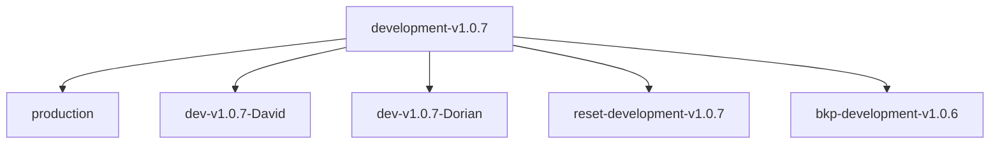
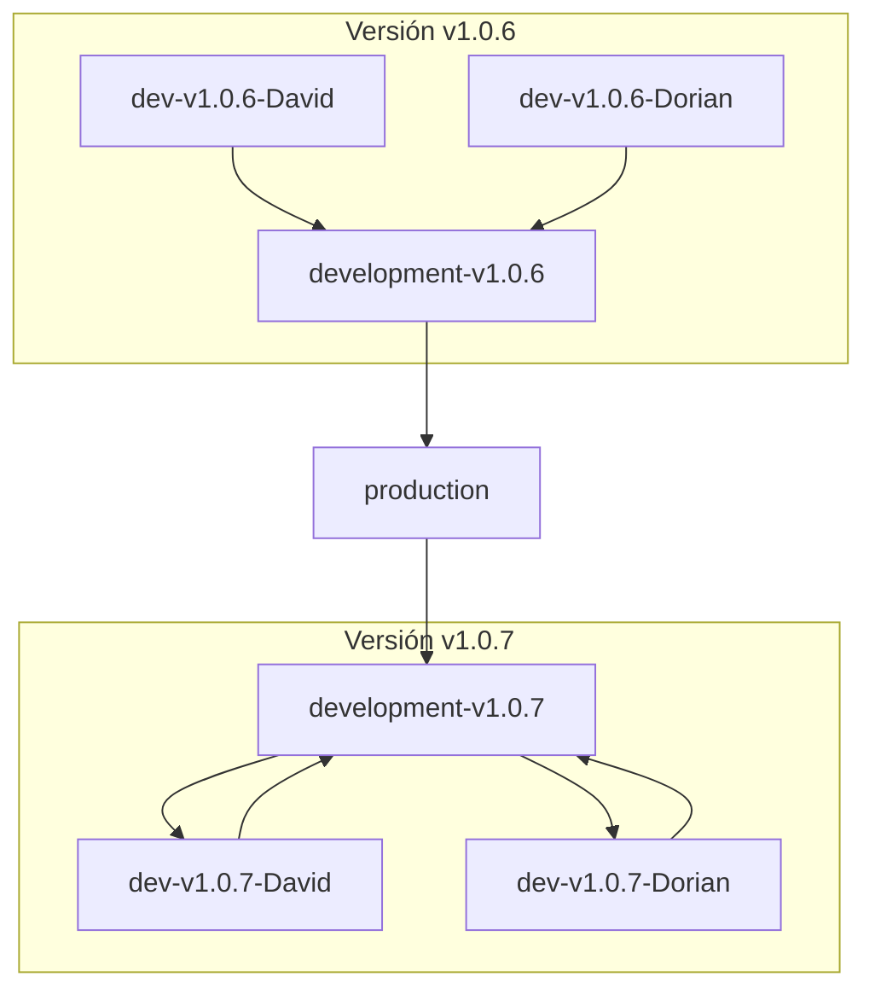

# Estrategia para el Uso de Ramas en GitHub

## Introducción

Esta estrategia define una forma estructurada de trabajar con ramas en un repositorio de GitHub. El objetivo es optimizar la colaboración entre desarrolladores, garantizar la estabilidad del código funcional y facilitar una integración controlada hacia producción, manteniendo una organización por versiones y por colaborador.

---

## Estructura de las Ramas

### Rama Producción (`production`)
La rama `production` contiene el código estable y listo para despliegues en el entorno de producción. Es el punto central desde el cual se derivan las ramas de desarrollo de nuevas versiones.

- Uso: Integración final y despliegues.
- Protección: Evitar pushes directos; requerir PRs aprobados.
- Actualización: Solo recibe cambios desde la rama activa de desarrollo de versión (`development-vx.x.x`) mediante PRs.

---

### Rama de Desarrollo por Versión (`development-vx.x.x`)
Cada versión tiene una rama de desarrollo dedicada `development-vx.x.x` (ej. `development-v1.0.7`), basada en `production`. Es el núcleo para integrar cambios desarrollados por colaboradores.

- Se crea como copia exacta de `production` al iniciar el desarrollo de una nueva versión.
- Se define como la rama por defecto del repositorio mientras se trabaja esta versión.
- Recibe PRs exclusivamente desde las ramas individuales de colaboradores.

---

### Ramas de Colaboradores (`dev-vx.x.x-Nombre`)
Cada colaborador trabaja en su propia rama aislada, derivada de la rama de desarrollo de versión correspondiente.

- Ejemplos: `dev-v1.0.7-David`, `dev-v1.0.7-Dorian`.
- Flujo: Los cambios en estas ramas se integran a su respectiva rama de desarrollo de versión a través de PRs.

---

### Ramas de Respaldo y Restauración
Para garantizar la preservación del historial y facilitar posibles restauraciones, se usarán ramas dedicadas:

- Respaldo: `bkp-development-v1.0.6`.
- Restauración: `reset-development-v1.0.6`.

---

## Diagrama: Estructura General

---

## Diagrama: Cambio de Versión

Los pasos del proceso al iniciar una nueva versión:

1) Se hace PR de `development-v1.0.6` hacia `production` tras pasar las validaciones (QA, pruebas de integración, etc.).
2) Se crea una rama de nueva versión (`development-v1.0.7`) como copia exacta de `production` y se define como la rama por defecto.
3) Cada colaborador crea su propia rama derivada de la nueva rama de desarrollo (`development-v1.0.7`).

---

## Flujo Operativo Detallado

1. **Finalización de la Versión Actual (v1.0.6):**
   - Los colaboradores trabajan en sus ramas individuales (`dev-v1.0.6-*`) y envían PRs hacia `development-v1.0.6`.
   - Una vez aprobadas las integraciones, se realiza un PR desde `development-v1.0.6` hacia `production`.

2. **Inicio de una Nueva Versión (v1.0.7):**
   - Se crea la rama `development-v1.0.7` como una copia exacta de `production`.
   - La nueva rama de desarrollo se configura como la rama por defecto.
   - Cada colaborador crea su propia rama derivada de `development-v1.0.7`.

3. **Desarrollo en la Nueva Versión:**
   - Los colaboradores envían PRs desde sus ramas individuales (`dev-v1.0.7-*`) hacia `development-v1.0.7`.
   - Una vez completadas las validaciones y QA, la rama `development-v1.0.7` se integra en `production`.

---

## Beneficios

- Organización clara de ramas por versión activa y colaboradores.
- `Production` como rama de referencia para despliegues garantiza estabilidad.
- PRs asegurados como puntos de control para la integración de cambios.
- Planificación de restauraciones y respaldos simplificada con ramas específicas.
