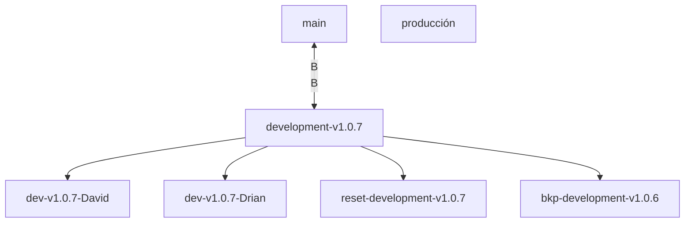
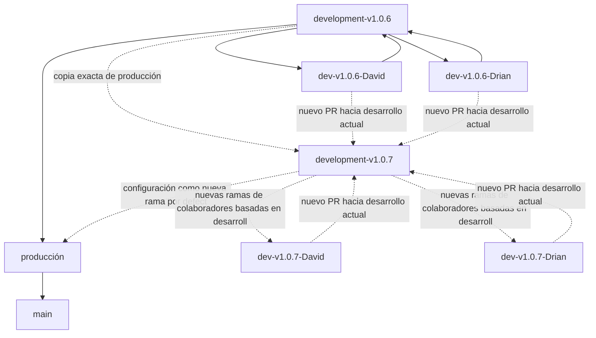

# Estrategia para el Uso de Ramas en GitHub

## Introducción

La siguiente estrategia define una forma estructurada de trabajar con las ramas en un repositorio de GitHub. Este enfoque optimiza la colaboración entre desarrolladores, garantiza la estabilidad del código funcional y facilita una integración controlada en producción.

## Estructura de las Ramas

### Rama Main (`main`)
La rama `main` contiene código estable y listo para producción. Solo recibe actualizaciones desde la rama `producción` después de pruebas exhaustivas.

**Utilización:**  
- Exclusivamente para lanzamientos a producción.  
- Protegida contra sobrescrituras accidentales.

---

### Rama Producción (`producción`)
La rama `producción` sirve de puente entre `main` y `development-vx.x.x`. Recibe código desde `development-vx.x.x` aprobado mediante pruebas de integración. Prepara el código para despliegues definitivos.

**Utilización:**  
- Para pruebas finales en un entorno de pre-producción.  
- Plataforma para validación antes de fusionarse con `main`.

---

### Rama de Desarrollo por Versión (`development-vx.x.x`)
Cada versión importante tiene una rama de desarrollo específica (`development-vx.x.x`). Servirá como la base para todos los trabajos relacionados con esa versión.

**Utilización:**  
- Al incrementar una versión, se crea una nueva rama `development-vx.x.x` como el punto principal de interacción.  
- Las ramas personalizadas de los desarrolladores derivan de esta rama.

**Nota:**  
La nueva rama creada (`development-vx.x.x`) se configura como la nueva rama por defecto del repositorio.

---

### Ramas de Colaboradores
Cada desarrollador trabaja en una rama personalizada derivada de `development-vx.x.x`. El formato del nombre sigue el estándar `dev-vx.x.x-NombreColaborador`.

Ejemplo:  
- `dev-v1.0.7-David`  
- `dev-v1.0.7-Drian`

**Utilización:**  
- Espacio aislado para desarrollar nuevas funcionalidades.  
- Los cambios se envían a la rama de desarrollo actual (`development-vx.x.x`) mediante Pull Requests (PRs).

---

### Ramas de Respaldo y Restauración
Ramas de respaldo (`bkp-*`) y restauración (`reset-*`) aseguran la integridad y disponibilidad de versiones adicionales.

Ejemplo:  
- `bkp-development-v1.0.7`  
- `reset-development-v1.0.6`

**Utilización:**  
- Para restaurar estados previos o proteger entregas importantes.  
- Ante problemas mayores, sirven para volver a puntos funcionales.

---

## Representación en Diagrama de Estrategia

---

## Representación en Diagrama: Cambio de Versión

El siguiente diagrama explica el proceso de transición al trabajar con una nueva versión en el repositorio. Cada nuevo incremento de versión requiere crear ramas específicas para el desarrollo y los colaboradores.

---

## Explicación del Proceso

### 1. Creación de Nueva Rama de Desarrollo (Versión Actual)
Cuando se incrementa la versión del proyecto, se crea una nueva rama llamada `development-vx.x.x` (por ejemplo, `development-v1.0.7`):
- Esta nueva rama es una copia exacta del contenido actual que se encuentra en `producción`.
- La rama `development-v1.0.7` será configurada como la nueva rama por defecto del repositorio.

### 2. Creación de Nuevas Ramas de Colaboradores
Para cada desarrollador en el equipo, se crean nuevas ramas derivadas de `development-vx.x.x`:
- Ejemplo: `dev-v1.0.7-David`, `dev-v1.0.7-Drian`.
- Cada colaborador trabajará en su propia rama, asegurando un espacio aislado para el desarrollo de nuevas funcionalidades o corrección de defectos.

### 3. Flujo de Trabajo de Ramas
- Las ramas de los colaboradores (`dev-vx.x.x-Nombre`) deben enviar una Pull Request (PR) hacia la rama de desarrollo actual (`development-v1.0.7`).
- Una vez integrados y aprobados, los cambios serán evaluados en `producción`.

### 4. Configuración de la Nueva Rama por Defecto
Después de crear la nueva rama de desarrollo (`development-v1.0.7`), esta se configura como la nueva rama por defecto del repositorio:
- Esto garantiza que los nuevos desarrollos se centralicen y trabajen en la versión vigente.

### 5. Flujo hacia Producción y Main
Las actualizaciones aprobadas en `development-v1.0.7` se integran posteriormente en la rama `producción`. Una vez validadas en preproducción, los cambios serán fusionados en `main` para el despliegue definitivo.

---

## Beneficios de Esta Estrategia

- **Organización:** La creación de nuevas ramas por versión y por colaborador simplifica el seguimiento de tareas y cambios.
- **Estabilidad:** Las copias basadas en ramas validadas (como `producción`) garantizan que el desarrollo comience desde un estado funcional.
- **Control:** El uso de ramas por defecto asegura que los colaboradores trabajen siempre en la versión correspondiente, evitando conflictos o mezclas entre versiones.
