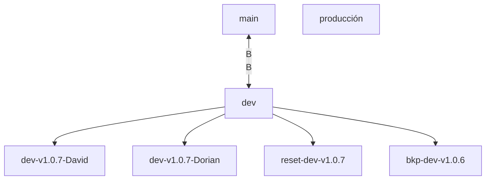

# Estrategia para el Uso de Ramas en GitHub

## Introducción

La siguiente estrategia define una forma estructurada de trabajar con las ramas en un repositorio de GitHub. Este enfoque busca optimizar la colaboración entre desarrolladores, asegurar la estabilidad del código funcional y permitir una integración controlada en el entorno de producción.

Esta metodología está inspirada en prácticas adoptadas en proyectos como IAM, donde se establece una estructura clara y jerárquica para la gestión de ramas.

## Estructura de las Ramas

### Rama Main (`main`)
La rama `main` es la base del repositorio. Está destinada al código estable y listo para producción. Solo debe recibir actualizaciones desde la rama `producción` después de que se hayan realizado pruebas exhaustivas.

**Utilización:**  
- Exclusivamente para lanzamientos a producción.  
- Protegida contra implementaciones directas para evitar sobrescrituras accidentales.

---

### Rama Producción (`producción`)
La rama `producción` sirve como un puente entre las ramas `main` y `dev`. Recibe código desde `dev` una vez que este ha sido aprobado y probado. Su propósito es preparar el código estable para su despliegue.

**Utilización:**  
- Para pruebas en el entorno de pre-producción.  
- Plataforma para validaciones finales antes de ser fusionada en `main`.

---

### Rama de Desarrollo (`dev`)
La rama `dev` almacena la integración de todo el código funcional y aprobado por el equipo. Es el punto de encuentro para las contribuciones de distintas ramas de desarrollo individuales.

**Utilización:**  
- Ideal para pruebas de integración a nivel grupal.  
- Recibe Pull Requests (PRs) desde ramas específicas pertenecientes a desarrolladores o funcionalidades.

---

### Ramas de Desarrolladores o Funcionalidades
Cada desarrollador trabaja en una rama personalizada derivada de `dev`. Estas ramas se nombran siguiendo el formato `dev-vx.x.x-nameDev1`, donde:
- `vx.x.x` corresponde a la versión con la cual está vinculada.
- `nameDev1` hace referencia al desarrollador responsable.

Ejemplo:  
- `dev-v1.0.7-David`  
- `dev-v1.0.7-Dorian`

**Utilización:**  
- Espacio aislado para desarrollo por desarrollador o funcionalidad.  
- Los cambios se envían a `dev` mediante PRs para revisión y pruebas.

---

### Ramas de Respaldo y Restauración
En proyectos complejos, las ramas de respaldo (`bkp-*`) y restauración (`reset-*`) aseguran la integridad del código, permitiendo restaurar versiones anteriores cuando se requiera.

Ejemplo:  
- `bkp-dev-v1.0.7`  
- `reset-dev-v1.0.6`

**Utilización:**  
- Respaldo de puntos específicos en el desarrollo.  
- Restauración ante problemas mayores o cambios irreversibles.

---

## Beneficios de la Estrategia

### 1. Mejora en la Colaboración
El uso de ramas aisladas por desarrollador permite que todo el equipo pueda trabajar simultáneamente sin conflictos de código.

### 2. Garantía de Estabilidad
Solo el código probado y aprobado fluye hacia ramas superiores como `dev`, `producción` y `main`. Esto protege los entornos productivos y asegura la estabilidad.

### 3. Control de Versiones
Los nombres explícitos de las ramas permiten identificar rápidamente la función y el propietario de cada desarrollo, además de respaldar un seguimiento histórico claro.

### 4. Integración Controlada
Los Pull Requests actúan como puntos de control que permiten a los revisores inspeccionar, aprobar y fusionar cambios con calidad garantizada.

---

## Representación en Diagrama

---

## Ejemplo de Flujo de Trabajo

1. **Flujo de Desarrollador**:  
   - Trabajan en su rama personalizada (ejemplo: `dev-v1.0.7-David`).  
   - Una vez terminado el desarrollo, se envía un Pull Request hacia `dev`.  
   - Tras pruebas, el código se integra a `dev`.

2. **Flujo de Release**:  
   - El código integrado en `dev` pasa a `producción`.  
   - Después de validaciones finales, se fusiona con `main` para su despliegue.

3. **Versionado y Respaldo**:  
   - Las ramas `bkp-*` contienen momentos históricos del desarrollo.  
   - Las ramas `reset-*` están disponibles para revertir el código en caso necesario.

---

## Justificación de la Estrategia

- **Organización:** Separar las ramas por desarrollador, función y propósito permite un flujo de trabajo ordenado y altamente colaborativo.  
- **Fiabilidad:** Las pruebas en cada nivel de las ramas garantizan un entorno seguro y confiable para producción.  
- **Escalabilidad:** Este enfoque es flexible y puede soportar proyectos pequeños o grandes sin comprometer la calidad del código.
