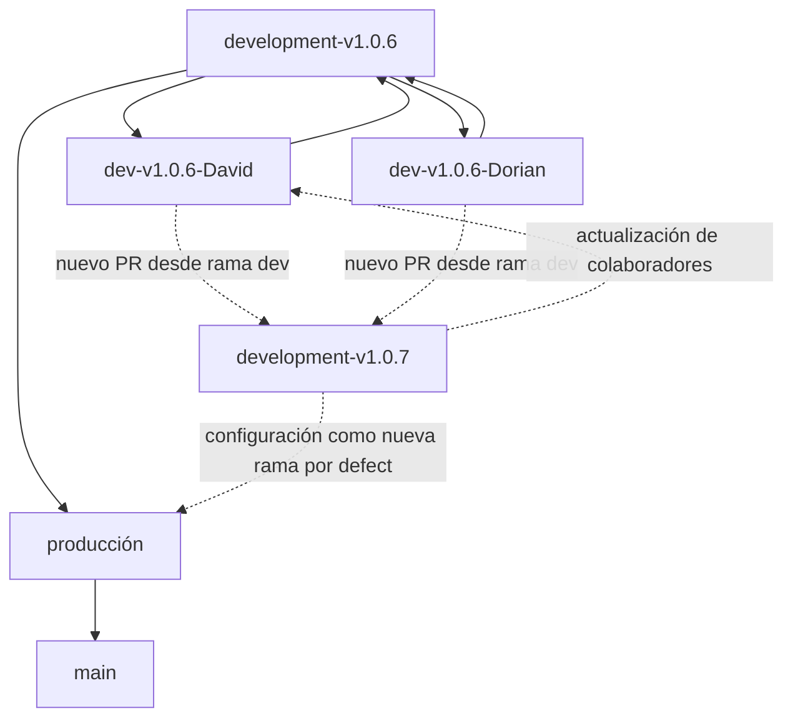

# Estrategia para el Uso de Ramas en GitHub

## Introducción

La siguiente estrategia define una forma estructurada de trabajar con las ramas en un repositorio de GitHub. Este enfoque optimiza la colaboración entre desarrolladores, garantiza la estabilidad del código funcional y facilita una integración controlada en producción.

## Estructura de las Ramas

### Rama Main (`main`)
La rama `main` contiene código estable y listo para producción. Solo recibe actualizaciones desde la rama `producción` después de pruebas exhaustivas.

**Utilización:**  
- Exclusivamente para lanzamientos a producción.  
- Protegida contra sobrescrituras accidentales.

---

### Rama Producción (`producción`)
La rama `producción` sirve de puente entre `main` y `development-vx.x.x`. Recibe código desde `development-vx.x.x` aprobado mediante pruebas de integración. Prepara el código para despliegues definitivos.

**Utilización:**  
- Para pruebas finales en un entorno de pre-producción.  
- Plataforma para validación antes de fusionarse con `main`.

---

### Rama de Desarrollo por Versión (`development-vx.x.x`)
Cada versión importante tiene una rama de desarrollo específica (`development-vx.x.x`). Servirá como la base para todos los trabajos relacionados con esa versión.

**Utilización:**  
- Al incrementar una versión, se crea una nueva rama `development-vx.x.x` como el punto principal de interacción.  
- Las ramas personalizadas de colaboradores derivan de esta rama.

**Nota:**  
La nueva rama creada (`development-vx.x.x`) debe configurarse como la rama por defecto del repositorio.

---

### Ramas de Colaboradores
Cada desarrollador trabaja en su rama personalizada derivada de `development-vx.x.x`. El formato del nombre sigue `dev-vx.x.x-NombreColaborador`.

Ejemplo:  
- `dev-v1.0.7-David`  
- `dev-v1.0.7-Dorian`

**Utilización:**  
- Espacio aislado para desarrollar nuevas funcionalidades.  
- Los cambios se envían a la rama `development-vx.x.x` mediante Pull Requests (PRs).

---

### Ramas de Respaldo y Restauración
Ramas de respaldo (`bkp-*`) y restauración (`reset-*`) aseguran la integridad y disponibilidad de versiones adicionales.

Ejemplo:  
- `bkp-development-v1.0.7`  
- `reset-development-v1.0.6`

**Utilización:**  
- Para restaurar estados previos o proteger entregas importantes.  
- Ante problemas mayores, sirven para volver a puntos funcionales.

---

## Representación en Diagrama de Estrategia

---

## Representación en Diagrama de Manejo de Versiones

El siguiente diagrama muestra el proceso de incrementación de una versión y cómo se adaptan las ramas:

---

## Ejemplo de Flujo de Trabajo

### Creación de una Nueva Versión:

1. Cuando se requiere una nueva versión (por ejemplo, de `v1.0.6` a `v1.0.7`), se realiza lo siguiente:
   - Crear una nueva rama `development-v1.0.7`.
   - Configurar esta nueva rama como la rama por defecto del repositorio.

2. Actualización de los colaboradores:
   - Todas las ramas individuales (`dev-vx.x.x-NombreColaborador`) deben derivarse de la nueva rama `development-vx.x.x` y vincularse al trabajo de la versión actual.

---

## Justificación de la Estrategia

- **Organización:** La separación de ramas por propósito, versión y colaborador simplifica el trabajo colaborativo.  
- **Fiabilidad:** Las validaciones jerárquicas minimizan riesgos en producción.  
- **Escalabilidad:** Este enfoque es adaptable a proyectos pequeños y grandes, manteniendo la calidad del código.
